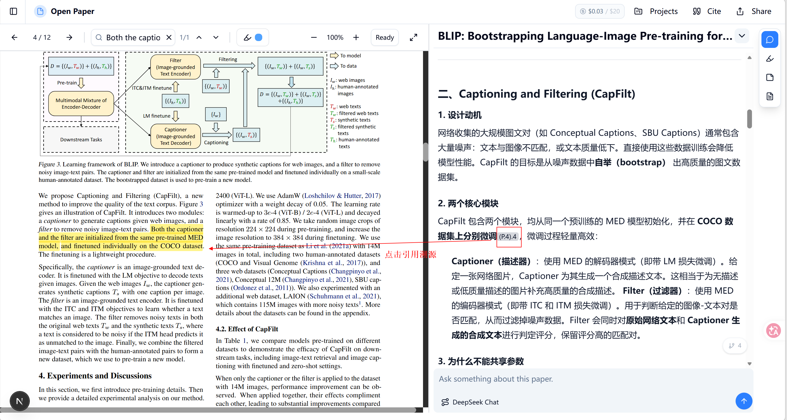
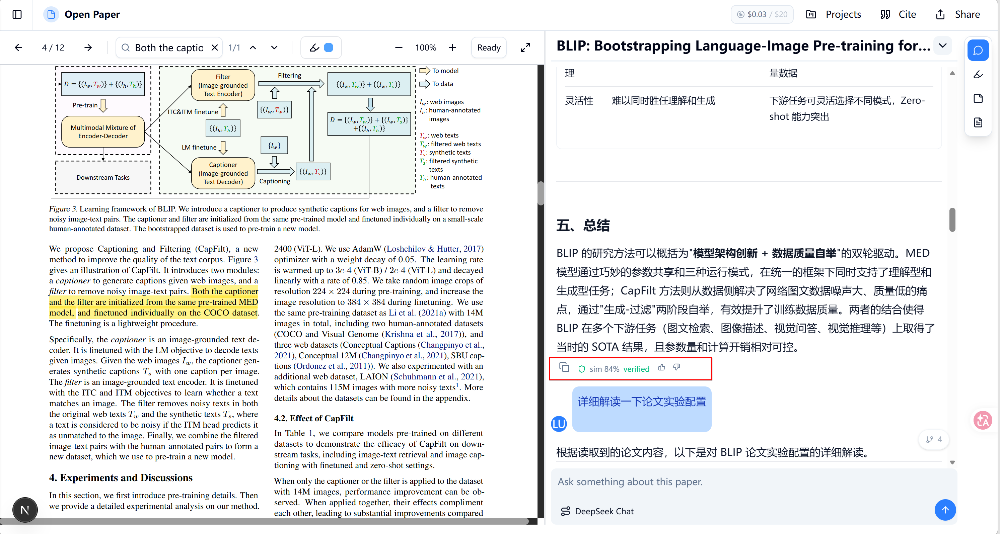

# DeepRead

> 个人本地文献阅读智能工作站——深度阅读、精准标注、透彻理解。

基于 React 前端 + Python 后端的本地论文阅读助手，集成 6 工具 ReAct 智能体、双轨 PDF 解析、幻觉检测、树状对话等功能。

## 功能

### 论文阅读

- **PDF 阅读器**：文字高亮、下划线标注、高亮点击跳转
- **双轨解析**：PyMuPDF（快速）+ Marker（验证级，含分页结构）
- **RAG 检索**：ChromaDB 语义搜索 + 交叉编码器重排序
- **划词翻译**：选中文本一键翻译（DeepSeek）

### AI 对话

- **ReAct 智能体**：6 个工具（read/search/compare/note/skill/run），SSE 流式输出
- **树状对话**：编辑任意历史消息自动分叉，← → 按钮切换版本
- **引用点击跳转**：点击 `(P.3, "引文")` 自动定位到 PDF 对应位置
- **幻觉检测**：引用验证 + 语义相似度 + 数值交叉校验
- **Guard 摘要栏**：每条 AI 回复底部显示可信度，支持 👍👎 反馈

  

  

### Agent 能力

- **自我反思**：任务结束后自动分析工具调用模式，生成改进笔记
- **Skill 系统**：支持单文件 `.md` 和目录包（SKILL.md + scripts/ + references/）
- **多模型路由**：Claude / DeepSeek / OpenAI，自动 fallback
- **上下文压缩**：超过 80% token 限制自动压缩

### 知识管理

- **项目对话**：跨论文讨论，项目级上下文
- **Obsidian 集成**：Agent 可直接读写 Obsidian vault 笔记
- **对话历史**：侧边栏可折叠历史记录，支持搜索

## 技术栈

| 层       | 技术                                       |
| -------- | ------------------------------------------ |
| 前端     | Next.js 15, React, Tailwind CSS, shadcn/ui |
| 后端     | FastAPI, SQLite, ChromaDB                  |
| PDF 解析 | PyMuPDF（快速）, Marker（验证级）          |
| 向量化   | BGE-large-en-v1.5 + BGE-reranker-v2-m3     |
| 大模型   | Claude / DeepSeek / OpenAI，统一路由       |
| Agent    | ReAct 循环 + SSE 流式 + 自我反思           |

## 快速开始

```bash
# 1. 安装后端依赖
cd backend && pip install -r requirements.txt

# 2. 配置 API Key
cp .env.example .env
# 编辑 .env 填入: DEEPSEEK_API_KEY, CLAUDE_API_KEY, OPENAI_API_KEY

# 3. 启动后端
python main.py                    # → http://localhost:8000

# 4. 启动前端（新终端）
cd frontend && npm install && npm run dev  # → http://localhost:3000
```

## 项目结构

```
DeepRead/
├── backend/
│   ├── agent/          # ReAct 循环、提示词构建、工具注册、压缩
│   ├── api/            # FastAPI 路由
│   ├── core/           # 向量化、幻觉检测、LLM 路由、RAG、解析器
│   ├── data/           # SQLite 数据库层
│   ├── services/       # 对话、论文、标注、记忆服务
│   ├── tools/          # Agent 工具: read, search, compare, note, run
│   └── main.py         # 入口
├── frontend/
│   └── src/
│       ├── app/        # Next.js 页面
│       ├── components/ # UI 组件
│       └── lib/        # API 客户端、类型定义、hooks
├── skills/             # Agent 技能模板
├── tests/              # 测试
├── config.yaml         # LLM 和用户配置
└── storage/            # 运行时数据（gitignore）
```

## 配置

编辑 `config.yaml`：

```yaml
llm:
  default_provider: "deepseek"
  providers:
    claude:
      api_key: "${CLAUDE_API_KEY}"
      model: "claude-sonnet-4-6"
    deepseek:
      api_key: "${DEEPSEEK_API_KEY}"
      model: "deepseek-chat"

profile:
  field: "自然语言处理"
  level: "研究生"
  language: "中文"

budget:
  monthly_limit_usd: 20
  on_exceed: "downgrade"   # 超额降级，或 "block" 阻断
```

## License

MIT
